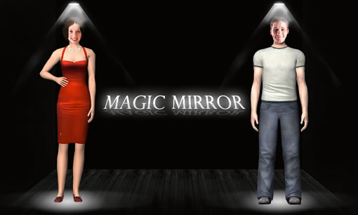

# MagicMirror
魔镜

当年参加过 <b>Android全国大学生移动互联网创业挑战赛</b>，地址是：

http://www.google.cn/university/androidchallenge/2011/gallery.html#tab=d1-15

程序截图：

关于程序所用到的3D模型为通过 Maya 导出的obj格式文件，以及解析此3D模型格式文件。

obj格式文件实例：

# The units used in this file are centimeters.  
　　g default  
　　v -0.500000 -0.500000 0.500000  
　　v 0.500000 -0.500000 0.500000  
　　v -0.500000 0.500000 0.500000  
　　v 0.500000 0.500000 0.500000  
　　v -0.500000 0.500000 -0.500000  
　　v 0.500000 0.500000 -0.500000  
　　v -0.500000 -0.500000 -0.500000  
　　v 0.500000 -0.500000 -0.500000  
　　vt 0.000000 0.000000  
　　vt 1.000000 0.000000  
　　vt 0.000000 1.000000  
　　vt 1.000000 1.000000  
　　vt 0.000000 2.000000  
　　vt 1.000000 2.000000  
　　vt 0.000000 3.000000  
　　vt 1.000000 3.000000  
　　vt 0.000000 4.000000  
　　vt 1.000000 4.000000  
　　vt 2.000000 0.000000  
　　vt 2.000000 1.000000  
　　vt -1.000000 0.000000  
　　vt -1.000000 1.000000  
　　vn 0.000000 0.000000 1.000000  
　　vn 0.000000 0.000000 1.000000  
　　vn 0.000000 0.000000 1.000000  
　　vn 0.000000 0.000000 1.000000  
　　vn 0.000000 1.000000 0.000000  
　　vn 0.000000 1.000000 0.000000  
　　vn 0.000000 1.000000 0.000000  
　　vn 0.000000 1.000000 0.000000  
　　vn 0.000000 0.000000 -1.000000  
　　vn 0.000000 0.000000 -1.000000  
　　vn 0.000000 0.000000 -1.000000  
　　vn 0.000000 0.000000 -1.000000  
　　vn 0.000000 -1.000000 0.000000  
　　vn 0.000000 -1.000000 0.000000  
　　vn 0.000000 -1.000000 0.000000  
　　vn 0.000000 -1.000000 0.000000  
　　vn 1.000000 0.000000 0.000000  
　　vn 1.000000 0.000000 0.000000  
　　vn 1.000000 0.000000 0.000000  
　　vn 1.000000 0.000000 0.000000  
　　vn -1.000000 0.000000 0.000000  
　　vn -1.000000 0.000000 0.000000  
　　vn -1.000000 0.000000 0.000000  
　　vn -1.000000 0.000000 0.000000  
　　s off  
　　g pCube1  
　　usemtl initialShadingGroup  
　　f 1/1/1 2/2/2 4/4/3 3/3/4  
　　f 3/3/5 4/4/6 6/6/7 5/5/8  
　　f 5/5/9 6/6/10 8/8/11 7/7/12  
　　f 7/7/13 8/8/14 2/10/15 1/9/16  
　　f 2/2/17 8/11/18 6/12/19 4/4/20  
　　f 7/13/21 1/1/22 3/3/23 5/14/24  
　　
其中， 
顶点数据(Vertex data)：  
　　v  几何体顶点 (Geometric vertices)  
　　vt 贴图坐标点 (Texture vertices)  
　　vn 顶点法线 (Vertex normals)  
　　vp 参数空格顶点 (Parameter space vertices) 
元素(Elements):   
　　p 点 (Point)   
　　l 线 (Line)   
　　f 面 (Face)   
　　curv 曲线 (Curve)   
　　curv2 2D曲线 (2D curve)  
　　surf 表面 (Surface)  
　　
　　
